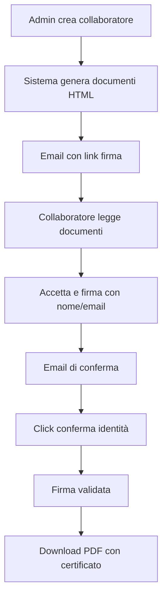

# 📋 UpToTen Compliance Management System

Sistema completo per la gestione della compliance dei collaboratori (tutor, consulenti, formatori) con firma digitale legalmente valida, gestione documenti e tracking del limite €5.000 per prestazioni occasionali.

## 🌟 Caratteristiche Principali

### 📊 Dashboard Amministrativa
- **Gestione Collaboratori**: CRUD completo con tracking limite €5.000 annuale
- **Generazione Documenti Automatica**: Crea documenti personalizzati basati sul tipo di contratto
- **Sistema di Badge Status**: Visualizzazione immediata dello stato firma documenti
- **Compliance Monitoring**: Alert per collaboratori vicini al limite €5.000
- **Export Dati**: Esportazione ricevute in CSV per contabilità

### 📝 Sistema Documenti Intelligente
- **Template HTML Personalizzati**: Documenti generati con dati del collaboratore pre-compilati
- **Documenti Specifici per Tipo Contratto**:
  - **Prestazione Occasionale**: Modulo occasionale + Dichiarazione indipendenza
  - **Partita IVA**: Contratto P.IVA + Dichiarazione pluricommittenza
  - **Misto**: Tutti i documenti necessari
- **Clausola Riservatezza**: Obbligatoria per tutti i collaboratori

### ✍️ Firma Digitale Avanzata
- **Processo in 3 Step**:
  1. Lettura e accettazione documenti online
  2. Firma con nome/email
  3. Conferma via email per validazione
- **Validità Legale**:
  - Conforme al Regolamento eIDAS (UE) n. 910/2014
  - Rispetta il D.Lgs. 82/2005 (CAD)
  - Hash SHA-256 per integrità documento
  - Tracking IP, timestamp e dispositivo

### 📧 Sistema Email Automatizzato
- **Resend Integration**: 3000 email/mese gratuite
- **Edge Functions Supabase**: Nessuna esposizione API key nel frontend
- **Email Personalizzate**:
  - Invito firma documenti
  - Conferma identità
  - Ricevuta documenti firmati

### 📥 Download Documenti
- **PDF Generati Dinamicamente**: Conversione HTML→PDF con certificato di firma
- **Certificato di Firma Incluso**: Pagina finale con tutti i dettagli tecnici e legali
- **Download Singolo o Multiplo**: Scarica uno o tutti i documenti firmati

## 🛠️ Stack Tecnologico

- **Frontend**: HTML5, CSS3, JavaScript Vanilla (no framework dependencies)
- **Backend**: Supabase (PostgreSQL + Edge Functions)
- **Email**: Resend API
- **PDF Generation**: jsPDF + html2canvas
- **Database**: PostgreSQL con schema `compliance`

## 📂 Struttura Progetto (AGGIORNATA)

```
C:\App UpToTen\Dati di fatturazione\
├── src/
│   ├── admin/                 # Dashboard amministrativa
│   │   ├── index.html        # Pagina principale admin
│   │   ├── app.js           # Logica dashboard
│   │   ├── validation.js    # Modulo validazione input
│   │   ├── error-handler.js # Gestione errori globale
│   │   ├── dialogs.js       # Sistema dialog personalizzati
│   │   ├── performance.js   # Ottimizzazione performance
│   │   ├── document-templates.js  # Template documenti HTML
│   │   ├── pdf-generator.js      # Generatore PDF
│   │   └── styles.css            # Stili dashboard
│   ├── frontend/                  # Portale collaboratori
│   │   ├── firma.html            # Portale firma documenti
│   │   ├── firma-app.js         # Logica firma
│   │   ├── conferma.html        # Pagina conferma email
│   │   ├── conferma-app.js      # Logica conferma
│   │   ├── download-documenti.html # Pagina download
│   │   ├── download-documenti.js  # Logica download
│   │   └── firma-styles.css      # Stili frontend
│   ├── shared/                   # Configurazione e utilità condivise
│   │   ├── config.js            # Configurazione centralizzata
│   │   └── logger.js            # Sistema logging intelligente
│   └── lib/                      # Librerie comuni (future)
├── assets/                       # Risorse statiche
│   ├── pdf-templates/           # Template PDF
│   └── images/                  # Immagini
├── database/                     # Schema database
│   └── schema-compliance.sql    # DDL completo database
├── supabase/                     # Supabase configuration
│   └── functions/
│       └── send-email/          # Edge Function per invio email
│           └── index.ts         # Codice Edge Function
├── PDF-documentazione da firmare/ # Template PDF originali
├── package.json                  # Dipendenze e script progetto
└── .env                          # Variabili ambiente (non committato)
    ├── Clausola di Riservatezza.pdf
    ├── Contratto di Collaborazione con Partite IVA.pdf
    ├── Modulo_Collaborazione_Occasionale.pdf
    └── Pluricommittenza e autonomia partita iva.pdf
```

## 🚀 Installazione

### 1. Prerequisiti
- Account [Supabase](https://supabase.com)
- Account [Resend](https://resend.com) per invio email
- Browser moderno (Chrome, Firefox, Edge)
- Node.js per Supabase CLI (opzionale)

### 2. Setup Database Supabase

1. Crea un nuovo progetto su Supabase
2. Vai su **SQL Editor** e esegui lo script `database/schema-compliance.sql`
3. **IMPORTANTE**: Disabilita RLS per testing o configura le policy:

```sql
-- Per testing (NON sicuro per produzione)
ALTER TABLE compliance.collaboratori DISABLE ROW LEVEL SECURITY;
ALTER TABLE compliance.documenti DISABLE ROW LEVEL SECURITY;
ALTER TABLE compliance.firme_digitali DISABLE ROW LEVEL SECURITY;
ALTER TABLE compliance.ricevute DISABLE ROW LEVEL SECURITY;
```

### 3. Configurazione

1. Apri `admin/config.js`
2. Inserisci le tue credenziali Supabase:

```javascript
const SUPABASE_CONFIG = {
    url: 'https://TUO-PROGETTO.supabase.co',
    anonKey: 'TUA-ANON-KEY'
};
```

3. Configura Resend API key nell'Edge Function (vedi sezione Edge Functions)

### 4. Deploy Edge Function

1. Installa Supabase CLI:
```bash
npm install -g supabase
```

2. Login e link progetto:
```bash
supabase login
supabase link --project-ref TUO-PROJECT-REF
```

3. Imposta Resend API key:
```bash
supabase secrets set RESEND_API_KEY=TUA_RESEND_API_KEY
```

4. Deploy Edge Function:
```bash
cd "C:\App UpToTen\Dati di fatturazione"
supabase functions deploy send-email --no-verify-jwt
```

### 5. Avvio Applicazione

Apri `admin/index.html` in un browser o usa un server locale:

```bash
# Con Python
python -m http.server 8000

# Con Node.js
npx serve

# Con VS Code
Usa l'estensione "Live Server"
```

## 📖 Guida Utilizzo

### Per l'Amministratore

1. **Login Dashboard**
   - Apri `admin/index.html`
   - Usa credenziali test: `admin@uptoten.it` / `uptoten2024`

2. **Creare Nuovo Collaboratore**
   - Click su "+ Nuovo Collaboratore"
   - Compila i dati (auto-fill attivo per testing)
   - Click "Salva e Invia Documenti"
   - Il sistema genera documenti e invia email automaticamente

3. **Monitorare Compliance**
   - Tab "Compliance Status" mostra:
     - Documenti mancanti
     - Collaboratori vicini al limite €5.000
     - Documenti in scadenza

4. **Gestire Ricevute**
   - Tab "Ricevute" per visualizzare pagamenti
   - Export CSV per contabilità
   - Tracking automatico limite €5.000

### Per il Collaboratore

1. **Riceve Email con Link**
   - Click sul link "Accedi al Portale Firma"
   
2. **Firma Documenti**
   - Legge ogni documento (HTML formattato)
   - Spunta checkbox "Ho letto" e "Accetto"
   - Inserisce nome e email
   - Click "Firma Tutti i Documenti"
   
3. **Conferma Email**
   - Riceve email di conferma
   - Click "Conferma la mia Firma"
   
4. **Download Documenti**
   - Dopo conferma, vede bottone "Scarica i Documenti Firmati"
   - Può scaricare singoli PDF o tutti insieme
   - Ogni PDF include certificato di firma digitale

## 🔧 Personalizzazione

### Modificare Template Documenti
Edita `admin/document-templates.js`:

```javascript
generateClausolaRiservatezza(collaboratore) {
    return `
        <h1>Il tuo template HTML</h1>
        <p>Dati: ${collaboratore.nome}</p>
    `;
}
```

### Aggiungere Nuovi Tipi Documento
1. Aggiungi tipo in `database/schema-compliance.sql` nel CHECK constraint
2. Crea template in `document-templates.js`
3. Aggiungi logica in `generateDocumentiCollaboratore()`

### Personalizzare Email
Modifica `supabase/functions/send-email/index.ts` per i template email

### Modificare Limiti
In `database/schema-compliance.sql`:
```sql
limite_annuale DECIMAL(10,2) DEFAULT 5000.00  -- Modifica qui
```

## 🔒 Sicurezza & Logging

### Sistema di Logging Completo
I log sono salvati in **3 livelli** per massima tracciabilità:

1. **Database `audit_log`**: Ogni azione tracciata permanentemente
   - Accesso portale firma
   - Documenti firmati con hash
   - Conferme email
   - Download PDF
   - Modifiche dati

2. **Resend Dashboard**: Log email per 30 giorni
   - Email inviate/consegnate/aperte
   - Bounce e problemi
   - IP e timestamp apertura

3. **Edge Functions Logs**: 
   - Errori e debug
   - Performance monitoring

### Conservazione Permanente Email
- Webhook Resend → Database per conservazione illimitata
- Tabella `email_logs` dedicata (opzionale)
- Tutti i dettagli email salvati in `audit_log`

### Sicurezza Implementata
- **API Keys**: Mai esposte nel frontend (usano Edge Functions)
- **Hash SHA-256**: Per integrità documenti
- **Email Verification**: Doppia validazione identità
- **Audit Trail**: Tutto loggato in `audit_log`
- **RLS Policies**: Configurabili per produzione
- **HTTPS Only**: Tutte le comunicazioni criptate
- **No Cookie**: Nessun dato sensibile salvato localmente

## 📝 Note Legali

Il sistema implementa firma elettronica avanzata conforme a:
- **Regolamento eIDAS (UE) n. 910/2014**
- **D.Lgs. 82/2005 (CAD)**
- **Art. 2702 Codice Civile**

La validità legale deriva da:
- Identificazione univoca del firmatario
- Connessione univoca firma-firmatario  
- Controllo esclusivo del firmatario
- Rilevazione modifiche post-firma (hash)

## 🐛 Troubleshooting

### "Invalid API key" su Supabase
- Verifica la anon key in `config.js`
- Controlla che il progetto Supabase sia attivo

### Email non arrivano
- Verifica cartella SPAM
- Controlla logs Edge Function su Supabase
- Verifica API key Resend
- Controlla che Edge Function sia deployata

### Documenti vuoti
- Controlla che i documenti siano salvati nel database
- Verifica permessi RLS se attivi
- Controlla console browser per errori JS

### PDF non si scarica
- Verifica che il browser supporti html2canvas
- Controlla console per errori JavaScript
- Prova download come HTML (fallback)

### Limite €5.000 non funziona
- Verifica trigger database in `schema-compliance.sql`
- Controlla campo `importo_anno_corrente` in collaboratori

## 🔄 Workflow Completo



## 📊 Statistiche Sistema

- **Documenti per collaboratore**: 2-4 in base al tipo contratto
- **Tempo medio firma**: < 5 minuti
- **Email mensili stimate**: ~100-200 (dentro limite gratuito Resend)
- **Storage per collaboratore**: ~500KB (documenti HTML + firme)
- **Backup automatico**: Via Supabase (daily snapshots)

## 🎯 Roadmap Futura

- [ ] Dashboard analytics avanzate
- [ ] Integrazione calendario scadenze
- [ ] API REST per integrazioni esterne
- [ ] Multi-lingua (IT/EN)
- [ ] App mobile per firma
- [ ] Integrazione con servizi fiscali
- [ ] Bulk operations per molti collaboratori
- [ ] Template documenti custom via UI

## 🤝 Contribuire

Il sistema è proprietario ma accettiamo suggerimenti:
1. Segnala bug via email
2. Proponi miglioramenti
3. Richiedi nuove funzionalità

## 📞 Supporto

Per problemi o domande:
- **Email**: support@uptoten.it
- **Documentazione**: Questo README
- **Database**: Supabase Dashboard
- **Logs**: Edge Functions logs su Supabase

## ⚡ Performance

- **Caricamento dashboard**: < 2s
- **Generazione documenti**: < 1s per documento
- **Invio email**: < 3s
- **Generazione PDF**: < 5s
- **Database queries**: < 100ms

## 🔐 Backup & Recovery

1. **Database**: Backup automatico Supabase (daily)
2. **Documenti**: Storage su Supabase con replica
3. **Audit Log**: Non cancellabile, sempre disponibile
4. **Recovery**: Via Supabase dashboard o API

## 📄 Licenza

© 2024 UpToTen SRL - Tutti i diritti riservati

Sistema proprietario per uso interno aziendale.

---

**Sviluppato con ❤️ per UpToTen SRL**

*Sistema di Compliance Management per la gestione digitale dei collaboratori*

**Versione**: 1.0.0  
**Ultimo aggiornamento**: Dicembre 2024  
**Maintainer**: Team IT UpToTen